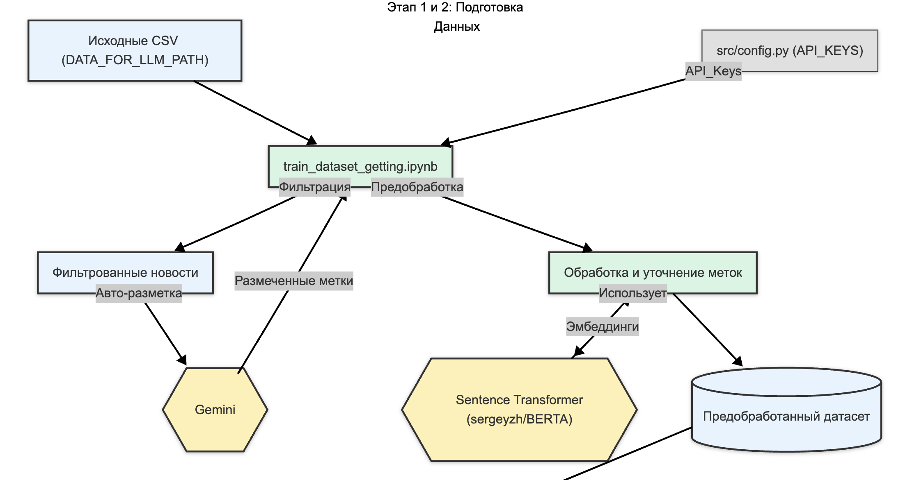
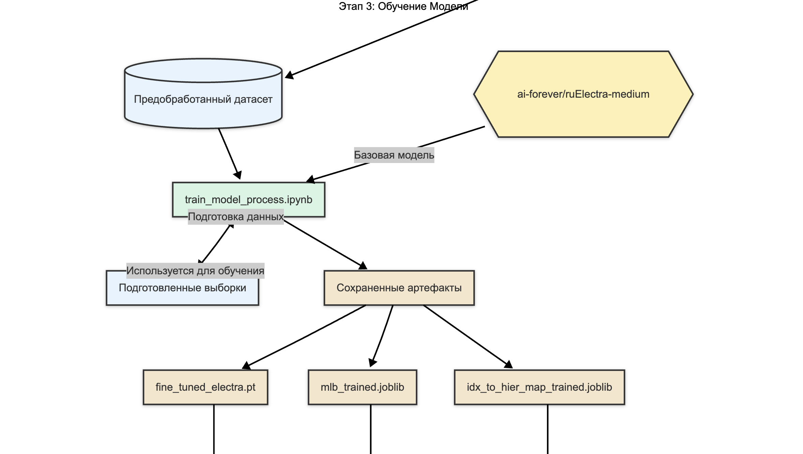
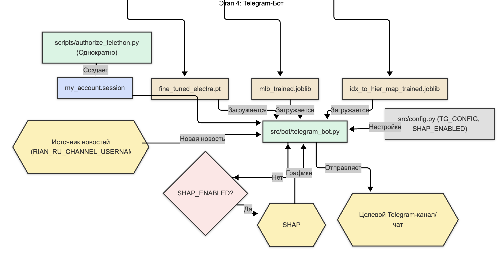

# ikanam_news

**Этот проект представляет собой Telegram-бота, который классифицирует новостные сообщения по различным категориям (например, #происшествия, #общество, #культура) с использованием моделей глубокого обучения. Бот анализирует текст входящих сообщений и автоматически присваивает им соответствующие теги.**

## Цель проекта

Основная цель проекта — разработка и внедрение системы автоматической классификации текстовых новостных сообщений для Telegram-бота. Это позволяет:

*   Эффективно организовывать и фильтровать новостной поток.
*   Упростить пользователям поиск интересующей информации по категориям.
*   Автоматизировать процесс тегирования новостей.

## Как это работает: Краткий обзор

1.  **Сбор и разметка данных**: Новости собираются из указанного источника. Затем, с помощью AI-модели (Google Gemini), они автоматически размечаются основными темами (мульти-метки) и более специфическими подтемами (иерархическая метка).
2.  **Предобработка данных**: Полученные метки проходят через этап очистки и улучшения. Например, редкие подтемы объединяются, а семантически схожие подтемы группируются с использованием текстовых эмбеддингов.
3.  **Обучение моделей классификации**: На подготовленном датасете обучается модель на базе Electra (`ai-forever/ruElectra-medium`) для двух задач: многоклассовой и иерархической классификации новостей.
4.  **Интеграция в Telegram-бота**: Обученная модель и необходимые артефакты (токенизатор, обработчики меток) загружаются в Telegram-бота.
5.  **Классификация в реальном времени**: Когда новая новость поступает в бот, модель классифицирует её, присваивая соответствующие теги.
6.  **Интерпретация (опционально)**: Для понимания, почему модель приняла то или иное решение, могут генерироваться SHAP-объяснения, визуализирующие вклад слов в предсказание.

## Структура проекта

Ниже представлена структура основных папок и файлов проекта, включая те, что могут быть созданы в процессе работы:

```
ikanam_news/
├── assets/                       # Статические и генерируемые файлы
│   └── shap_plots/               # Временно сохраняемые SHAP-графики перед отправкой
├── data/                         # Данные проекта
│   ├── external/                 # Внешние, исходные данные
│   │   └── data_for_llm/         # Например, RIA_before_2025.csv (исходные новости)
│   ├── raw/                      # "Сырые" данные после первичной обработки
│   │   └── processed_news_partial.pkl # Пример промежуточного датасета после разметки Gemini
│   └── user_data/                # Пользовательские данные
│       └── user_preferences.json # Сохраненные настройки пользователей бота
├── notebooks/                    # Jupyter ноутбуки для экспериментов и обучения
│   ├── train_dataset_getting.ipynb # Сбор, разметка (Gemini) и предобработка данных
│   ├── train_model_process.ipynb   # Обучение моделей классификации Electra
│   └── .ipynb_checkpoints/       # Автоматически создаваемая папка Jupyter
├── saved_models/                 # Сохраненные обученные модели и артефакты
│   ├── fine_tuned_electra.pt     # Пример имени файла обученной модели Electra
│   ├── mlb_trained.joblib        # Сохраненный MultiLabelBinarizer
│   └── idx_to_hier_map_trained.joblib # Сохраненный маппинг иерархических меток
├── scripts/                      # Вспомогательные скрипты
│   └── authorize_telethon.py     # Скрипт для авторизации клиента Telethon
├── sessions/                     # Файлы сессий
│   └── my_account.session        # Пример файла сессии Telethon (имя зависит от пользователя)
├── src/                          # Исходный код проекта
│   ├── bot/
│   │   └── telegram_bot.py       # Логика Telegram-бота
│   ├── core/
│   │   ├── main.py               # Основная логика: загрузка моделей, классификация
│   │   └── shap_explainer.py     # Логика генерации SHAP-объяснений
│   ├── workers/
│   │   └── gemini_workers.py     # Взаимодействие с Gemini API для разметки
│   ├── config.py                 # Конфигурационный файл (создается из config.py.example)
│   └── config.py.example         # Шаблон конфигурационного файла
├── .gitattributes                # Атрибуты Git
├── .gitignore                    # Файлы и папки, игнорируемые Git
├── environment.yml               # Файл для управления зависимостями Python (Conda)
└── requirements.txt              # Файл зависимостей для pip
```

## Конфигурация

Основные параметры проекта задаются в файле `src/config.py`. Ниже приведено описание каждого параметра:

*   `API_KEYS`: Список API ключей Gemini (можно и один указать, но тогда при прочих равных `notebooks/train_dataset_getting.ipynb` будет дольше отрабатывать и может получить rate limit). Используются для автоматической разметки данных.
*   `BOT_TOKEN`: Токен вашего Telegram-бота. Можно получить при регистрации бота у @BotFather.
*   `TARGET_CHANNEL_ID`: ID целевого Telegram-канала или чата, куда бот может отправлять сообщения или где он может выполнять какие-либо действия.
*   `TELEGRAM_API_ID`: Ваш API ID для работы с Telegram Client API (библиотека Telethon). Нужен для более продвинутого взаимодействия с Telegram, например, для чтения сообщений из других каналов. В данном случае из новостного канала. Можно получить на сайте [my.telegram.org/apps](https://my.telegram.org/apps).
*   `TELEGRAM_API_HASH`: Ваш API Hash для Telegram Client API. Идет в паре с `TELEGRAM_API_ID`.
*   `RIAN_RU_CHANNEL_USERNAME`: Имя пользователя Telegram-канала (например, "@rian_ru"), из которого бот читает новости для последующей классификации.

### Конфигурация SHAP Explainer

Эти параметры, также находящиеся в `src/config.py`, управляют работой SHAP (SHapley Additive exPlanations) — метода для интерпретации предсказаний моделей машинного обучения:

*   `SHAP_ENABLED`: Булево значение (`True` или `False`), включающее или отключающее генерацию SHAP-графиков. Эти графики помогают понять, какие слова в тексте новости оказали наибольшее влияние на ее классификацию.
*   `SHAP_TOP_N_ML_EXPLAIN`: Количество мульти-меток, для которых будут генерироваться объяснения SHAP. Например, если `1`, то объяснение будет строиться для самой вероятной мульти-метки.
*   `SHAP_MAX_FEATURES_DISPLAY`: Максимальное количество признаков (слов), отображаемых на waterfall-графике SHAP.
*   `SHAP_NSAMPLES`: Количество сэмплов, используемых SHAP Explainer для аппроксимации значений Шепли. Меньшее значение ускоряет расчеты, но может снизить точность объяснений.

## Установка

1.  **Клонируйте репозиторий:**
    ```bash
    git clone https://github.com/maxlyara1/ikanam_news.git
    cd ikanam_news
    ```

2.  **Настройте конфигурацию:**
    Исправьте файл `src/config.py.example` и переименуйте в `src/config.py` и заполните его своими значениями API-ключей, токенов и ID каналов, как описано в разделе "Конфигурация".

3.  **Создайте и активируйте окружение Conda (рекомендуется):**
    Если у вас установлен Conda, вы можете создать окружение на основе файла `environment.yml`:
    ```bash
    conda env create -f environment.yml
    conda activate ikanam_news_env
    ```

    **Установите зависимости (альтернативный способ, если вы используете pip):**
    Убедитесь, что у вас есть актуальный файл `requirements.txt`. Если его нет, его можно сгенерировать из окружения Conda или составить вручную. Затем выполните:
    ```bash
    pip install -r requirements.txt
    ```

## Подготовка данных и обучение моделей

Процесс состоит из двух основных шагов, реализованных в Jupyter ноутбуках:

### Шаг 1: Сбор, разметка и предобработка данных (`notebooks/train_dataset_getting.ipynb`)

Этот ноутбук выполняет следующие задачи:

1.  **Загрузка исходных данных**: Новости загружаются из CSV-файла (путь указан в `DATA_FOR_LLM_PATH` в ноутбуке).
2.  **Фильтрация**: Данные фильтруются по годам (`LIST_OF_YEARS`).
3.  **Автоматическая разметка с помощью Google Gemini**:
    *   Используется модель Gemini (например, `gemini-2.5-flash-preview-05-20`, указана в `DEFAULT_MODEL_NAME`) для присвоения каждой новости мульти-меток (основных тем) и одной иерархической метки (подтемы).
    *   Специальный промпт (`PROMPT_INSTRUCTION_TEMPLATE` из `src/workers/gemini_workers.py`) направляет Gemini для корректного извлечения информации.
    *   Обработка оптимизирована с помощью параллелизма, API-ключей, чанков и батчей.
4.  **Предобработка размеченных данных**:
    *   **Очистка и преобразование**: Метки приводятся к нужным форматам.
    *   **Работа с иерархическими метками**:
        *   Редкие подтемы (частота < `MIN_HIER_LABEL_COUNT`) объединяются в категорию "Другое".
        *   Схожие подтемы объединяются на основе семантического сходства их текстовых эмбеддингов (полученных с помощью Sentence Transformer модели, например, `sergeyzh/BERTA`). Порог сходства задается `SIMILARITY_THRESHOLD`.

Результатом является датасет, готовый для обучения моделей классификации. Промежуточные результаты сохраняются (например, в `processed_news_partial.pkl`).



### Шаг 2: Обучение моделей классификации (`notebooks/train_model_process.ipynb`)

В этом ноутбуке:

1.  **Загрузка предобработанных данных**.
2.  **Подготовка данных к обучению**:
    *   Разделение на обучающую и валидационную выборки.
    *   Создание `MultiLabelBinarizer` для мульти-меток и маппинга для иерархических меток на основе обучающей выборки.
    *   Вычисление весов для классов (для борьбы с дисбалансом).
3.  **Определение и обучение модели**:
    *   Используется трансформерная модель **Electra** (например, `ai-forever/ruElectra-medium`, указана как `MODEL_NAME`).
    *   Реализована кастомная архитектура `HierarchicalMultiTaskElectra`, которая одновременно обучается предсказывать мульти-метки и иерархическую метку.
    *   **Причины выбора Electra**:
        *   Хорошо подходит для русского языка.
        *   Обеспечивает хороший баланс качества и скорости.
        *   Подход Multi-Task Learning может улучшить общее качество.
    *   **Особенности обучения иерархической части**:
        *   **Иерархическая функция потерь (`HierarchicalCrossEntropyLoss`)**: Применяется кастомная функция потерь. Она включает стандартную кросс-энтропию и дополнительный штраф, зависящий от "расстояния" между предсказанной и истинной меткой в иерархии (контролируется параметром `HIER_PENALTY_SCALE`). Это стимулирует модель лучше усваивать иерархические зависимости.
        *   **Подготовка `parent_map`**: Для работы иерархической функции потерь автоматически строится карта связей "ребенок-родитель" (`parent_map_actual`). Исходные строковые метки (например, "['Категория', 'Подкатегория']") анализируются, и при необходимости создаются промежуточные родительские узлы (например, 'Категория') и даже общий корневой узел (`ROOT_HIER_NODE`). Эти узлы добавляются в общие маппинги меток.
        *   **Веса классов**: Для борьбы с дисбалансом классов вычисляются веса как для мульти-меток, так и для всех (включая созданные промежуточные) иерархических меток.
        *   **Обработка редких меток**: Иерархические метки, встречающиеся в обучающих данных только один раз, удаляются перед обучением для повышения стабильности.

4.  **Оценка и сохранение модели**:
    *   Модель оценивается на валидационной выборке.
    *   Обученная модель сохраняется (например, в `saved_models/fine_tuned_electra.pt`), вместе с `MultiLabelBinarizer` (например, `saved_models/mlb_trained.joblib`) и маппингом иерархических меток (например, `saved_models/idx_to_hier_map_trained.joblib`).



## Использование Telegram-бота

После подготовки данных и обучения моделей, можно запустить Telegram-бота.

### 1. Авторизация Telethon (однократно)
Для того чтобы бот мог читать сообщения из других каналов (например, `RIAN_RU_CHANNEL_USERNAME`), необходимо один раз авторизовать Telethon клиент:
```bash
python -m scripts.authorize_telethon
```
Следуйте инструкциям в консоли. Файл сессии будет сохранен в папку `sessions/`.

### 2. Запуск бота
```bash
python -m src.bot.telegram_bot
```
Бот начнет обрабатывать входящие сообщения из указанного в конфигурации канала:

*   **Получение новости**: Бот читает новое сообщение.
*   **Классификация**: Текст новости обрабатывается и подается на вход загруженной модели Electra. Модель предсказывает мульти-метки и иерархическую метку.
*   **Формирование ответа**: К новости добавляются предсказанные теги.
*   **SHAP-объяснения (если включено)**: Если `SHAP_ENABLED` в `src/config.py` установлено в `True`, генерируются и прикрепляются SHAP-графики, показывающие вклад слов в предсказание.
*   **Отправка результата**: Классифицированная новость с тегами (и, возможно, SHAP-графиками) отправляется в целевой чат/канал.

## Команды бота

Бот поддерживает следующие команды:

*   `/start` - Приветственное сообщение, отображает основные кнопки для взаимодействия с ботом, включая показ примера новости и переход к настройкам.
*   `/settings` - Открывает меню настроек пользователя, где можно:
    *   Включить/выключить автоматическую подписку на получение классифицированных новостей.
    *   Включить/выключить генерацию SHAP-графиков для объяснения предсказаний модели.
*   `/test_news` - Отправляет в чат пример заранее определенной новости, обработанной моделью. Это позволяет пользователю быстро оценить, как работает классификация и (если включено в настройках) SHAP-анализ.